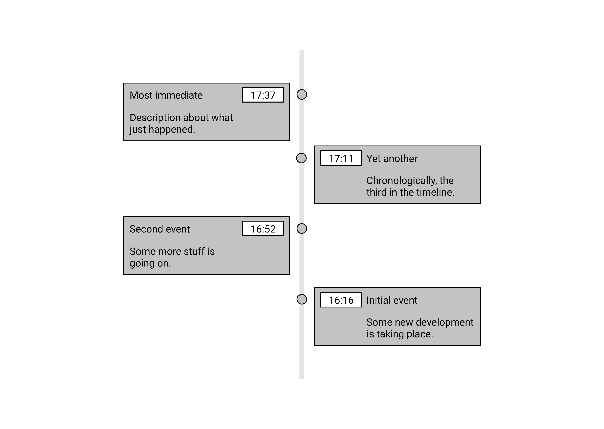
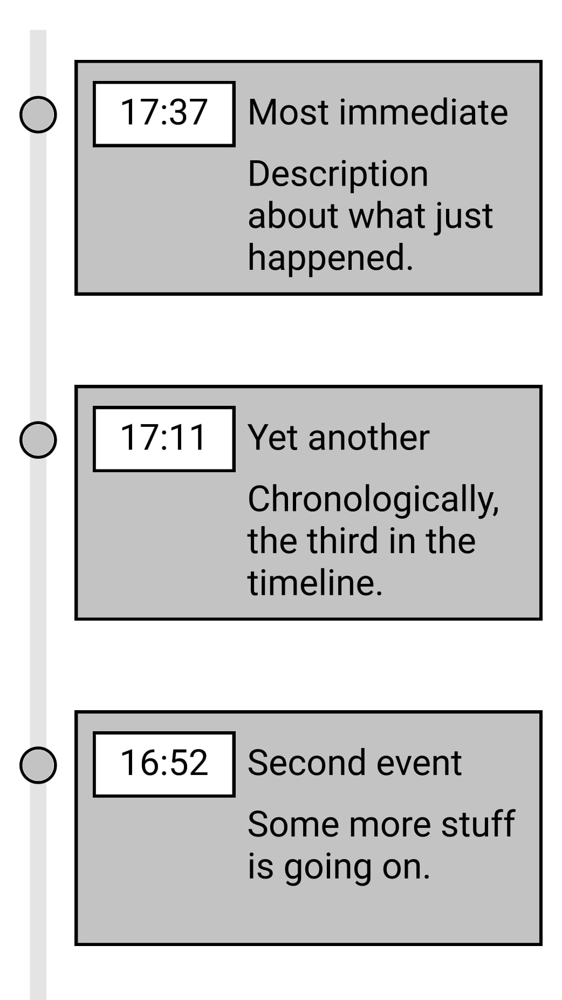

# Create a Timeline component in React

Create a React component that displays a Timeline of events by order of occurance, bottom to top. On Desktop, the events are to be staggered inbetween two branches, whereas on mobile they would collapse to a single branch (see [Wireframes](#the-end-result).)

Every 5 seconds a new event is to be added on top of the Timeline, up to a defined max (say, 5 or 6 elements.) After the cap has been reached, the last event is to be removed also. You can produce events in anyway you like, even re-use them from a predefined array.

Each Event is made of a:

- time
- title
- description

## Constraints

- The component needs to be a React component.
- You can't use any pre-existing component libraries.
- A simple instructable on how to view the example. Dependency `install` and `start` steps, at most.
- Host your solution on Github/Gitlab to share it with us.

## The end result

### Wireframe for Desktop

### Wireframe for Mobile

Coloring and design are up to you. Be creative, add decorations, animations/transitions that you feel would make for a good fit. Take the different aspect ratios into consideration.
